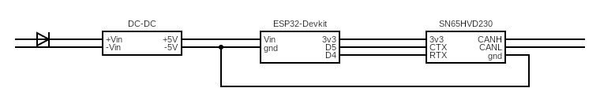

# jscan_esp — сканер J1939 на ESP32

Прошивка ESP32 (ESP-IDF 6.1, C/C++17) для чтения J1939-сообщений из CAN-шины.
TWAI (CAN) принимает фреймы, данные накапливаются в снапшоты и публикуются
браузеру через WiFi (softAP) + WebSocket (бинарный протокол, батч-снапшоты).

Бекенд построен по архитектуре TEMP_PID: нумерованные слои `01_core..05_storage`,
центральный event bus, BootManager с таблицей модулей и приоритетами.

## Архитектура

```
main/main.cpp                     — app_main(): AppContext + BootManager + REGISTER_MODULE

components/
  01_core/common/      — ядро: AppContext (event loop + EventManager + AppConfig),
                         AppEvents, EventManager, BootManager, SystemTiming,
                         HardwareConfig, AppConfig, J1939Proto (кадр+CRC16+батч)
  02_hardware/twai/    — «глупый» драйвер TWAI (без AppContext): узлы, ISR-слоты, transmit
  03_systems/j1939_system/ — координатор: J1939Decoder, TP (BAM/DT), SnapshotAccumulator,
                         J1939System (1 задача: rx + снапшот-таймер)
  04_network/wifi/     — WifiApModule (softAP, публикует WIFI_STATUS)
  04_network/server/   — ServerModule + StaticHandler (LittleFS) + WsHandler (WS)
  04_network/communication/ — CommunicationModule: кадр/CRC/диспатч команд, обёртка батча
  04_network/netctrl/  — NetworkController: владеет wifi + server
  05_storage/esp_littlefs/ — вендоренный LittleFS (esp_littlefs, Kconfig + project_include.cmake)
  05_storage/littlefs_service/ — обёртка над esp_littlefs (mount/read/stream)
  05_storage/config_store/  — ConfigStore: JSON config.json, дебаунс save, CONFIG_CHANGED
```

Модули общаются **только через event bus** (`AppEvents.h`), стартуют через
BootManager в порядке приоритетов:

| Модуль | Приоритет | critical | Смысл |
|---|---|---|---|
| `config` (ConfigStore) | 10 | true | конфиг нужен всем, монтирует LittleFS `config` |
| `comm` (CommunicationModule) | 20 | false | протокол/кадры/команды |
| `netctrl` (NetworkController) | 40 | false | владеет wifi + server (HTTP/WS/static) |
| `j1939` (J1939System) | 70 | false | TWAI-приём, TP, снапшоты |

Правило владения: `ctx->config` пишет только ConfigStore; снапшоты идут
J1939System → CommunicationModule → WsHandler (WS broadcast).

## Протокол

Полная спецификация — **`docs/PROTOCOL-J1939.md`** (источник истины). Кратко:
WS binary, кадр `magic 0x5A A5 | ver | flags | MsgType(2) | PayloadLen(2) |
Seq(2) | payload | CRC16`. `MsgType` `0x0001 J1939_SNAPSHOT` (батч
`{count, (sa, pgn, len, data, periodMs)*}`), `0x0002 J1939_REQUEST`.
SPN-декод выполняется на фронтенде.

## Сборка и прошивка

Установить расширение Espressif IDF для VSCode (используемая версия ESP-IDF — 6.1).

```bash
idf.py reconfigure   # создаёт build/compile_commands.json и managed_components/
idf.py build         # единственная проверка (тестов/линтера нет)
idf.py -p <COMx> flash monitor
```

Кастомная таблица разделов `partitions_new.csv` (factory app 1MB + LittleFS
`storage` 1MB + LittleFS `config` 256K) фиксируется в `sdkconfig.defaults`.
Статика фронта упаковывается из `frontend/dist` через
`littlefs_create_partition_image(storage ../frontend/dist FLASH_IN_PROJECT)`.

## Параметры

- Адрес узла J1939 — 25
- Пины TWAI: TX = 5, RX = 4, битрейт 250 кбит/с
- WiFi AP: SSID `J1939_AP`, пароль `12345678`, статический IP `10.10.10.10`
- HTTP-интерфейс: `http://10.10.10.10`, WebSocket: `ws://10.10.10.10/ws`
- Дефолты можно менять через `/config/config.json`

## Как проверить

1. Подключиться к AP `J1939_AP` (пароль `12345678`).
2. Подключиться к `ws://10.10.10.10/ws` (например, `websocat -b ws://10.10.10.10/ws`).
3. Должны приходить бинарные кадры снапшота: первые байты `5A A5 01 20 01 00 ...`
   (magic/ver/flags=SNAPSHOT/MsgType=J1939_SNAPSHOT). CRC16 на последних 2 байтах —
   CRC-16/CCITT-FALSE по всему кадру без CRC.

## Фронтенд

`frontend/dist/` содержит СБОРОЧНЫЙ bundle Vue3 из отдельного репозитория
(`pavellzubkov/vue3_embedded`); здесь лежит только готовый деплой. Текущий
фронт **не понимает** новый бинарный протокол — новый фронт пересобирается
отдельно под `docs/PROTOCOL-J1939.md`.

